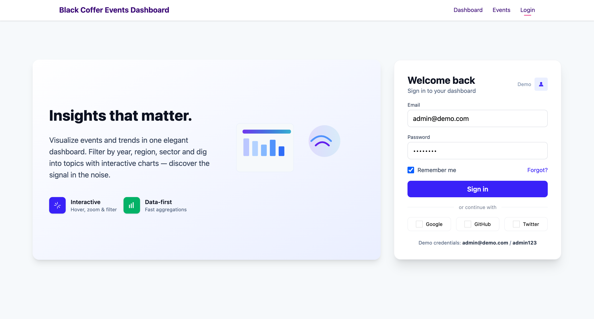
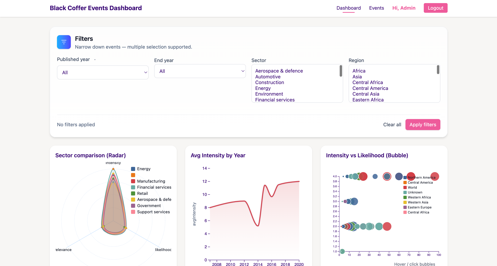
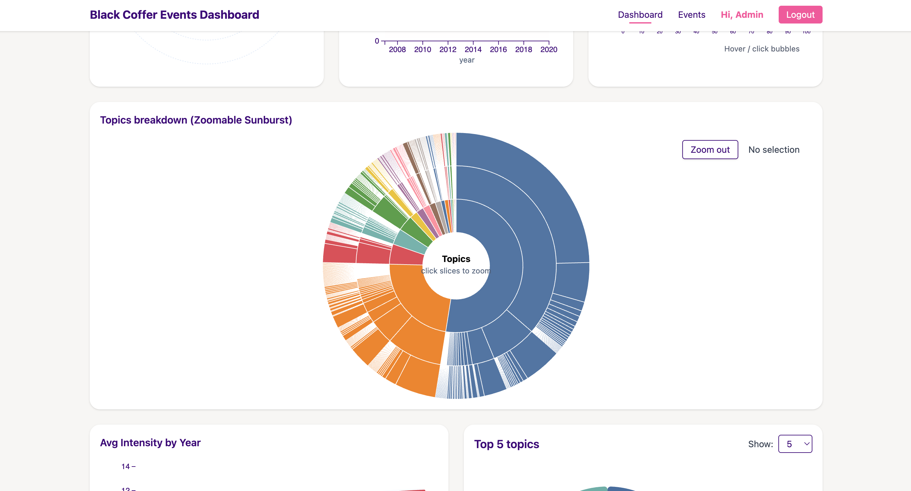
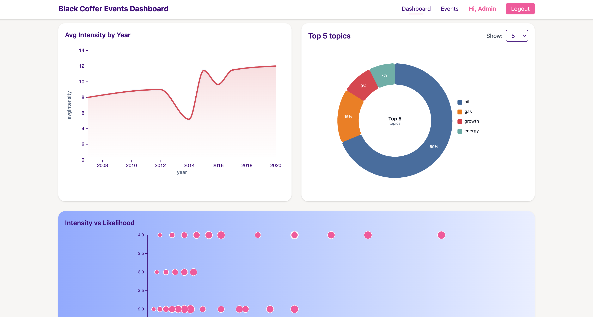
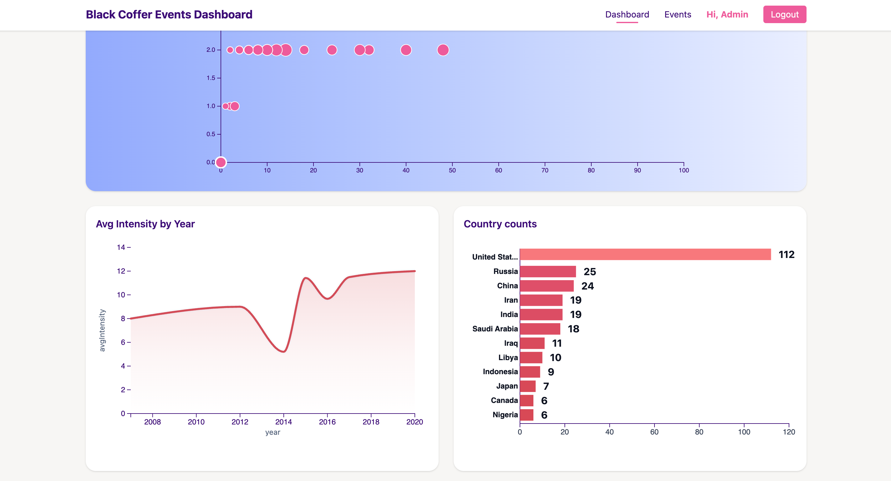
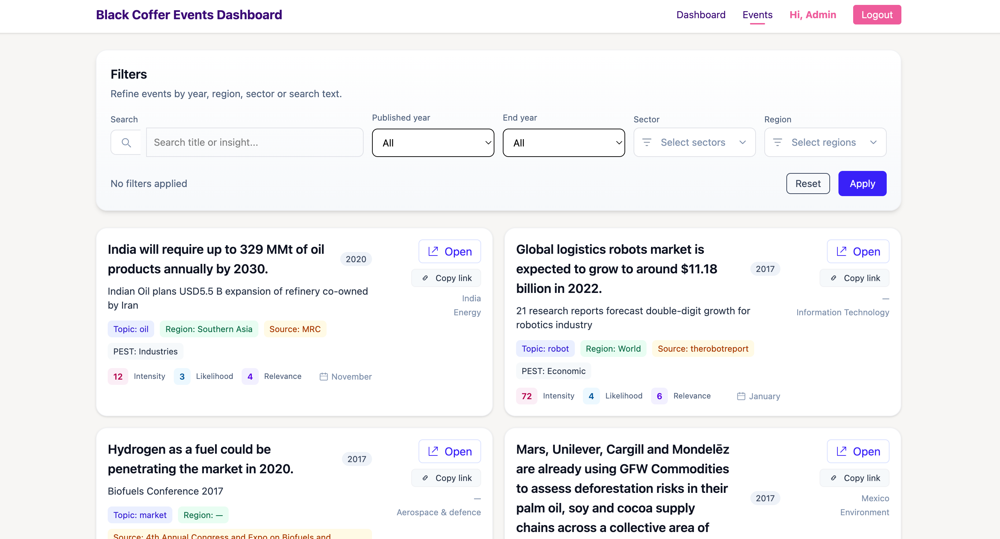
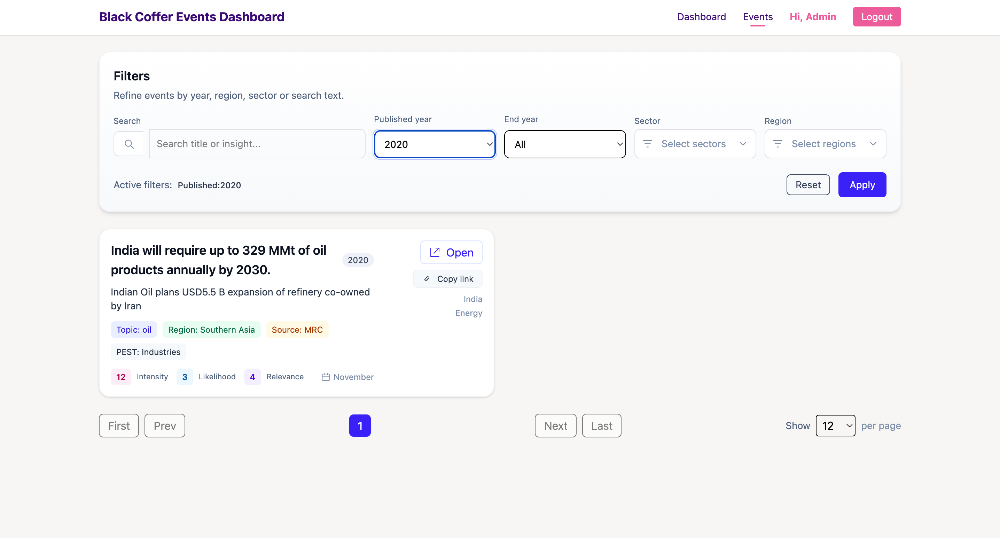

# Data Visualization Dashboard - (Blackcoffer Assignment)

### Test Assignment

This Assignment was created to Visualize Data give in file `jsondata.json`. The Dashboard visualize data to so we can understand & Analyze well!

## 1. Getting Started with the Project

### A. Requirements & Dependencies.

- [Docker](https://www.docker.com/products/docker-desktop/) - `v27.4.0`
- [Python](https://www.python.org/downloads/) - `v3.10.2`
- [NodeJs](https://nodejs.org/en/download) - `v22.16.0`

### B. Frameworks and Techstacks

#### 1. Front End

- [ReactJs](https://react.dev/) - `v19.2.0`
- [Vite](https://vite.dev/) - `v7.2.4`
- [D3.js](https://d3js.org/) - `v7.9.0`
- [Tailwind CSS](https://tailwindcss.com/) - `v4.1.17`
- [React Router Dom](https://reactrouter.com/) - `6.30.2`

#### 2. Backend End

- [Django](https://www.djangoproject.com/) - `v5.1`
- [Django Rest Framework](https://www.django-rest-framework.org/)
- [PyMongo](https://pypi.org/project/pymongo/)
- [MongoDB](https://www.mongodb.com/)

### C. Cloning this repository.

```shell
git clone
cd blackcoffer-assignment
```

### D. Starting Backend.

```shell
cd backend
docker-compose up -d
```

> Make sure docker desktop is running.

### E. Loading Sample data from `jsondata.json` file.

```shell
curl -X POST http://localhost:8000/api/import/
```

> This will load sample data from `jsondata.json` file into `mongoDB` database.

### F. Running frontend.

```shell
cd ..
cd frontend
npm install
npm run dev
```

> This will start frontend at `http://localhost:5173`, you can login using demo id (i.e. `admin@demo.com` and password as `admin123` which will be already filled)

## 2. Some screenshots and assets

When the above steps are complete and followed correctly, the frontend and backend will start and be running. You can vist `http://localhost:5173/login` to login and you well be greeted with below steps and UIs.

### A. Login Screen



### B. Dashboard Screens



> This is main Dashboard Screen where all the data is Visualized using graphsa and charts `D3.js`




> Here you can filter how many tops topics you wanna see, you can see `Top 5` or `Top 10` topics and it'll show you share of those top topics around the world.



> Here in this graph you can see `Average Intensity By Year` ans well as Counts of topics by each country.

### C. Events Page

This is events page where user can see all the events and filter the events based on filters i.e.

1. **Published Year**
2. **End year**
3. **Sector**
4. **Region**

Even user can search the topic in the search field



> Coming to events page, you can see all events, also you filter out events based you the filters given



> This project is made by Abhijeet Bhardwaj.
> `Thanks & Regards!`
